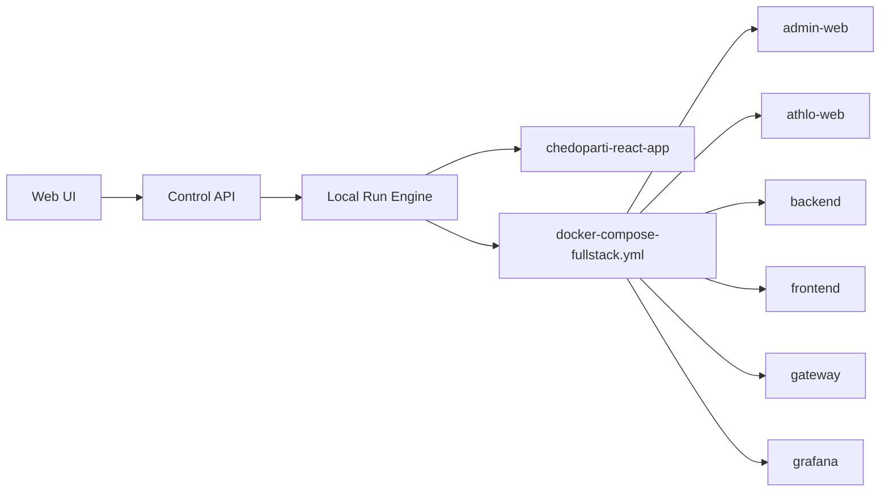
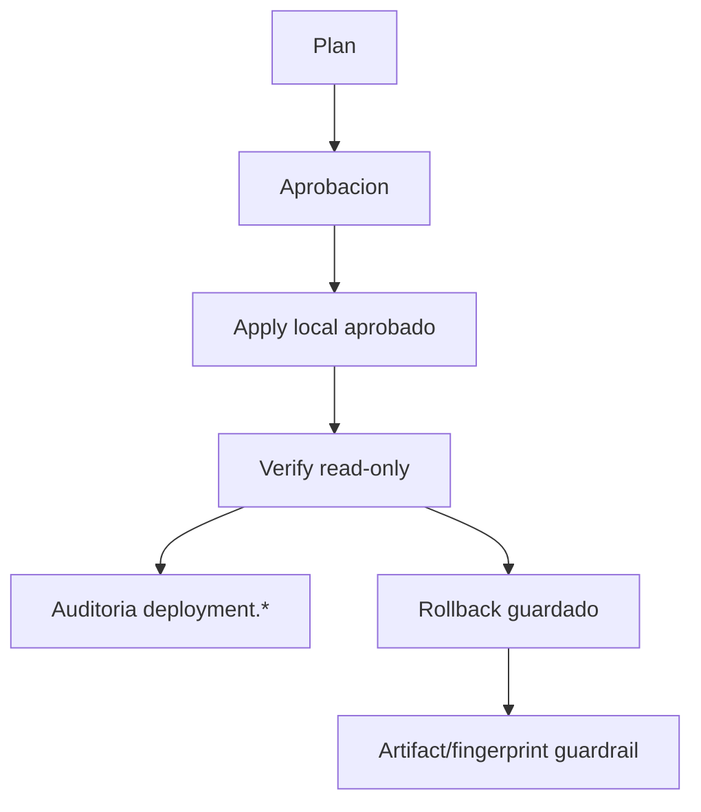
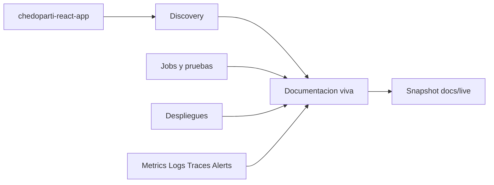

# Documentacion viva - Chedoparti React App

Generado: 2026-08-06T21:57:23.552Z
Proyecto: chedoparti-react-app
Repositorio: /Users/martiniano/Documents/chedoparti-react-app
Contrato: living-documentation.v2
Fase: Fase 12
Commit de origen: 41eb6f0 (codex/codex-repo-optimization-20260804)
Infraestructura verificada: 2026-08-06T21:57:22.746Z (PARTIALLY_CONFIGURED)
Integraciones verificadas: 2026-08-06T21:57:23.550Z
Documentacion oficial consultada: no consultada por generacion automatica
Fecha consulta docs oficiales: sin consulta
Estado: PARTIALLY_CONFIGURED
Confianza: Media (70/100)
Hash evidencia: 791cdf2c0339

## Cobertura obligatoria Fase 12

| Seccion | Estado | Evidencia |
| --- | --- | --- |
| Arquitectura | CONFIGURED_AND_VERIFIED | components=35, resources=145 |
| Componentes | CONFIGURED_AND_VERIFIED | declared=1, detected=34, verified=19 |
| Diagrama | CONFIGURED_AND_VERIFIED | diagrams=runtime-topology,deployment-flow,evidence-flow |
| Dependencias | PARTIALLY_CONFIGURED | manifests=20, lockfiles=2, packages=130 |
| Puertos | CONFIGURED_AND_VERIFIED | 5175->80/tcp, 3002->3002/tcp, 8080->8080/tcp, 5173->8080/tcp, 8989->8080/tcp, 3000->3000/tcp, 3100->3100/tcp, 1026->1025/tcp |
| Variables requeridas | CONFIGURED_AND_VERIFIED | SONAR_TOKEN:missing, SONAR_HOST_URL:configured, JENKINS_URL:configured |
| Secretos requeridos | CONFIGURED_AND_VERIFIED | SONAR_TOKEN |
| Comandos de ejecucion | CONFIGURED_AND_VERIFIED | start, stop, status, logs, smoke, restart |
| Build | CONFIGURED_AND_VERIFIED | apps/admin-web: npm run build, apps/athlo-bff: npm run build, apps/booking-web: npm run build, apps/public-web: npm run build, apps/tenant-web: npm run build, apps/web-next: npm run build, npm run build, chedoparti-backend: ./gradlew build |
| Tests | CONFIGURED_AND_VERIFIED | runnable=27, blocked=1 |
| Despliegue | PARTIALLY_CONFIGURED | plans=1, records=2 |
| Rollback | CONFIGURED_AND_VERIFIED | records=2, succeeded=1 |
| Migraciones | NOT_CONFIGURED | migrations=0 |
| Backups | CONFIGURED_NOT_VERIFIED | docs/operations/backups.md |
| Restauracion | CONFIGURED_NOT_VERIFIED | docs/operations/disaster-recovery.md |
| Observabilidad | RUNNING | generatedAt=2026-08-06T21:57:22.462Z |
| Seguridad | ERROR | secretScanning=ERROR, containerScanning=ERROR |
| Incidentes | PARTIALLY_CONFIGURED | failedJobs=22, failedDeployments=0 |
| Troubleshooting | CONFIGURED_AND_VERIFIED | docs/operations/runbooks.md |
| Integraciones externas | CONFIGURED_AND_VERIFIED | github, github, github, github, github, sonarqube, sonarqube, sonarqube, sonarqube, jenkins, jenkins, jenkins |
| Costos aproximados | CONFIGURED_NOT_VERIFIED | resources=145, liveCloudCalls=disabled |
| Limitaciones | CONFIGURED_AND_VERIFIED | findings=171 |

## Documentos por ambiente y proveedor

| Documento | Ambiente | Proveedor | Estado | Commit | No verificadas |
| --- | --- | --- | --- | --- | ---: |
| Ejecucion local | local | local | CONFIGURED_AND_VERIFIED | 41eb6f0 | 9 |
| Docker Compose | local | docker-compose | CONFIGURED_AND_VERIFIED | 41eb6f0 | 9 |
| VPS | vps | vps | PARTIALLY_CONFIGURED | 41eb6f0 | 9 |
| AWS | aws | aws | NOT_CONFIGURED | 41eb6f0 | 9 |
| Google Cloud | gcp | gcp | NOT_CONFIGURED | 41eb6f0 | 9 |
| Kubernetes | kubernetes | kubernetes | PARTIALLY_CONFIGURED | 41eb6f0 | 9 |

## Secciones no verificadas

- Dependencias: PARTIALLY_CONFIGURED - manifests=20, lockfiles=2, packages=130
- Despliegue: PARTIALLY_CONFIGURED - plans=1, records=2
- Migraciones: NOT_CONFIGURED - migrations=0
- Backups: CONFIGURED_NOT_VERIFIED - docs/operations/backups.md
- Restauracion: CONFIGURED_NOT_VERIFIED - docs/operations/disaster-recovery.md
- Observabilidad: RUNNING - generatedAt=2026-08-06T21:57:22.462Z
- Seguridad: ERROR - secretScanning=ERROR, containerScanning=ERROR
- Incidentes: PARTIALLY_CONFIGURED - failedJobs=22, failedDeployments=0
- Costos aproximados: CONFIGURED_NOT_VERIFIED - resources=145, liveCloudCalls=disabled

## Confianza

| Fuente | Estado | Score | Evidencia |
| --- | --- | ---: | --- |
| Estado declarado | CONFIGURED_NOT_VERIFIED | 65 | Descriptor YAML, componentes y ambientes declarados. |
| Discovery local | CONFIGURED_AND_VERIFIED | 100 | 43 manifests, stack=docker,git,gradle,jenkins,nextjs,node,sonarqube,vite. |
| Runtime verificado | CONFIGURED_AND_VERIFIED | 100 | El hub reconstruyo/recreo el runtime desde el fingerprint esperado. El proyecto todavia no expone endpoint de identidad propio para reportar fingerprint desde la app. |
| Calidad y seguridad | ERROR | 0 | 35 criticos, 10 warnings. |
| Observabilidad | RUNNING | 100 | metrics=PARTIALLY_CONFIGURED, logs=PARTIALLY_CONFIGURED, traces=NOT_CONFIGURED. |
| Infraestructura | PARTIALLY_CONFIGURED | 65 | 145 recursos detectados, drift=DRIFT_DETECTED. |
| Pruebas | PARTIALLY_CONFIGURED | 65 | 27 ejecutables, 1 bloqueadas. |
| Despliegues | PARTIALLY_CONFIGURED | 65 | 1 exitosos, 0 aprobaciones pendientes. |

## Guias

### Guia de onboarding local

Estado: CONFIGURED_AND_VERIFIED

Chedoparti React App vive en /Users/martiniano/Documents/chedoparti-react-app y se registra como chedoparti-react-app.

- Abrir el proyecto chedoparti-react-app en el panel.
- Revisar descriptor y componentes declarados para chedoparti-react-app.
- Validar links del proyecto antes de ejecutar acciones.
- Usar Configuration Doctor si cambia SONAR_HOST_URL, Jenkins o runtime.

Evidencia: stack=docker,git,gradle,jenkins,nextjs,node,sonarqube,vite

### Guia de runtime local

Estado: CONFIGURED_AND_VERIFIED

19 servicio(s) corriendo.

- Usar Start para recalcular Git y fingerprint.
- Usar Rebuild changed components o Clean rebuild para diagnosticar caches o imagenes dudosas.
- Consultar Terminal / logs si el runtime queda degraded o error.
- No ejecutar comandos fuera de perfiles aprobados desde el navegador.

Evidencia: freshness=matched, services=19

### Guia Plan / Apply / Verify / Rollback

Estado: PARTIALLY_CONFIGURED

Fase 6 separa plan, aprobacion, apply, verify y rollback guardado.

- Generar plan local y revisar blockers/warnings.
- Aprobar apply solo si el plan queda READY.
- Ejecutar apply y esperar registro terminal.
- Ejecutar verify read-only.
- Usar rollback solo si existe baseline/artifact verificable.

Evidencia: records=2, succeeded=1

### Guia de pruebas y observabilidad

Estado: PARTIALLY_CONFIGURED

La evidencia operativa cruza catalogo de pruebas, jobs, metrics, logs, traces y alertas.

- Ejecutar smoke desde el catalogo cerrado.
- Usar load solo con targets HTTP locales detectados.
- Revisar dashboard Project Observability por project label.
- No tratar ausencia de datos como exito.

Evidencia: tests=28, metrics=PARTIALLY_CONFIGURED

## Runbooks

### Runtime obsoleto o fallido

Trigger: freshness stale, failed, unverified o runtime error/degraded

Estado: CONFIGURED_AND_VERIFIED

- Abrir Gestion de entorno.
- Revisar fingerprint actual y ultimo deploy.
- Ejecutar Start.
- Si falla, abrir Terminal / logs y revisar primer error sanitizado.
- Repetir verify despues del runtime.

Evidencia: El hub reconstruyo/recreo el runtime desde el fingerprint esperado. El proyecto todavia no expone endpoint de identidad propio para reportar fingerprint desde la app.

### SonarQube no autorizado o sin snapshot

Trigger: Quality Gate sin datos, token invalido, 401, 403 o SonarQube apagado

Estado: CONFIGURED_NOT_VERIFIED

- Confirmar SONAR_HOST_URL del proyecto.
- Cargar SONAR_TOKEN desde Configuracion; el API no lo devuelve al navegador.
- Ejecutar tests/coverage antes de Sonar si falta coverage.
- Ejecutar Sonar y revisar Compute Engine/Quality Gate.

Evidencia: Sonar esta configurado, pero no hay snapshot verificado todavia.

### Rollback bloqueado

Trigger: ROLLBACK_NOT_AVAILABLE o ROLLBACK_ARTIFACT_NOT_AVAILABLE

Estado: PARTIALLY_CONFIGURED

- Leer el error del registro rollback.
- Confirmar que existe apply exitoso previo.
- No hacer git checkout manual desde Fase 7.
- Crear artifact store/versionado antes de afirmar rollback real entre revisiones.

Evidencia: ROLLBACK_ARTIFACT_NOT_AVAILABLE

### Sin senales de observabilidad

Trigger: metrics, logs o traces NOT_CONFIGURED/ERROR

Estado: RUNNING

- Abrir Grafana Project Observability.
- Validar que Prometheus/Loki/Tempo esten UP.
- Revisar labels project/environment.
- Agregar instrumentacion real en el repo externo antes de marcar verificado.

Evidencia: metrics=PARTIALLY_CONFIGURED, logs=PARTIALLY_CONFIGURED, traces=NOT_CONFIGURED

## Diagramas

### Topologia local verificada

Estado: CONFIGURED_AND_VERIFIED

### Plan Apply Verify Rollback

Estado: PARTIALLY_CONFIGURED

### Flujo de evidencia viva

Estado: RUNNING

## Historial reciente

| Tipo | Accion | Estado | Fecha | Evidencia |
| --- | --- | --- | --- | --- |
| docs-snapshot | docs.snapshot | PARTIALLY_CONFIGURED | 2026-08-06T21:56:58.718Z | 6c1cc70b5457 |
| audit | docs.snapshot | PARTIALLY_CONFIGURED | 2026-08-06T21:56:58.718Z | chedoparti-react-app:docs:015ad033-3079-436f-9653-4036fb152912 |
| audit | infrastructure.discovery.refresh | PARTIALLY_CONFIGURED | 2026-08-06T21:56:36.471Z | chedoparti-react-app:infrastructure:docker-compose |
| audit | infrastructure.discovery.refresh | PARTIALLY_CONFIGURED | 2026-08-06T21:56:35.796Z | chedoparti-react-app:infrastructure:local |
| docs-snapshot | docs.snapshot | PARTIALLY_CONFIGURED | 2026-08-06T04:17:51.906Z | 57353c5101bb |
| audit | docs.snapshot | PARTIALLY_CONFIGURED | 2026-08-06T04:17:51.906Z | chedoparti-react-app:docs:ba563a4f-6a69-4a8c-92e0-2fa6427ae1cd |
| audit | infrastructure.discovery.refresh | PARTIALLY_CONFIGURED | 2026-08-06T04:17:31.104Z | chedoparti-react-app:infrastructure:docker-compose |
| audit | infrastructure.discovery.refresh | PARTIALLY_CONFIGURED | 2026-08-06T04:17:29.785Z | chedoparti-react-app:infrastructure:local |
| docs-snapshot | docs.snapshot | PARTIALLY_CONFIGURED | 2026-08-06T04:16:41.345Z | docs/live/chedoparti-react-app.md |
| audit | docs.snapshot | PARTIALLY_CONFIGURED | 2026-08-06T04:16:41.345Z | chedoparti-react-app:docs:3d68c60d-a528-485e-a5d6-100f993493cb |
| docs-snapshot | docs.snapshot | PARTIALLY_CONFIGURED | 2026-08-06T04:16:14.795Z | e4150377e55a |
| audit | docs.snapshot | PARTIALLY_CONFIGURED | 2026-08-06T04:16:14.795Z | chedoparti-react-app:docs:3a8f5863-2757-4bc8-802b-3adac0c8de5a |
| audit | infrastructure.discovery.refresh | PARTIALLY_CONFIGURED | 2026-08-06T04:15:53.583Z | chedoparti-react-app:infrastructure:docker-compose |
| audit | infrastructure.discovery.refresh | PARTIALLY_CONFIGURED | 2026-08-06T04:15:52.914Z | chedoparti-react-app:infrastructure:local |
| docs-snapshot | docs.snapshot | PARTIALLY_CONFIGURED | 2026-08-06T04:07:20.794Z | docs/live/chedoparti-react-app.md |
| audit | docs.snapshot | PARTIALLY_CONFIGURED | 2026-08-06T04:07:20.794Z | chedoparti-react-app:docs:46debca0-6f33-4991-a0db-59b6145edd75 |
| docs-snapshot | docs.snapshot | PARTIALLY_CONFIGURED | 2026-08-06T04:06:32.816Z | 609798730b36 |
| audit | docs.snapshot | PARTIALLY_CONFIGURED | 2026-08-06T04:06:32.816Z | chedoparti-react-app:docs:b5f96b48-b02e-45ce-a517-682be937015a |
| audit | infrastructure.discovery.refresh | PARTIALLY_CONFIGURED | 2026-08-06T04:06:14.000Z | chedoparti-react-app:infrastructure:docker-compose |
| audit | infrastructure.discovery.refresh | PARTIALLY_CONFIGURED | 2026-08-06T04:06:12.860Z | chedoparti-react-app:infrastructure:local |

## Findings

- warning: LIVING_DOCS_SOURCE_NOT_VERIFIED - 35 criticos, 10 warnings.
- info: LIVING_DOCS_OFFICIAL_DOCS_NOT_CONSULTED - El snapshot registra esta ausencia explicitamente; no se inventan fuentes externas.
- info: LIVING_DOCS_PHASE12_DOCUMENTS_UNVERIFIED - VPS:PARTIALLY_CONFIGURED, AWS:NOT_CONFIGURED, Google Cloud:NOT_CONFIGURED, Kubernetes:PARTIALLY_CONFIGURED
- info: LIVING_DOCS_PHASE12_SECTIONS_UNVERIFIED - Dependencias:PARTIALLY_CONFIGURED, Despliegue:PARTIALLY_CONFIGURED, Migraciones:NOT_CONFIGURED, Backups:CONFIGURED_NOT_VERIFIED, Restauracion:CONFIGURED_NOT_VERIFIED, Observabilidad:RUNNING

